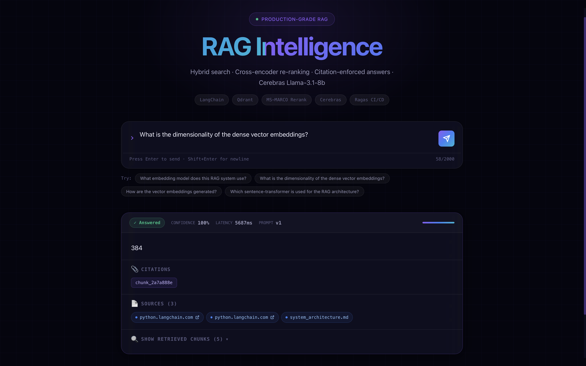
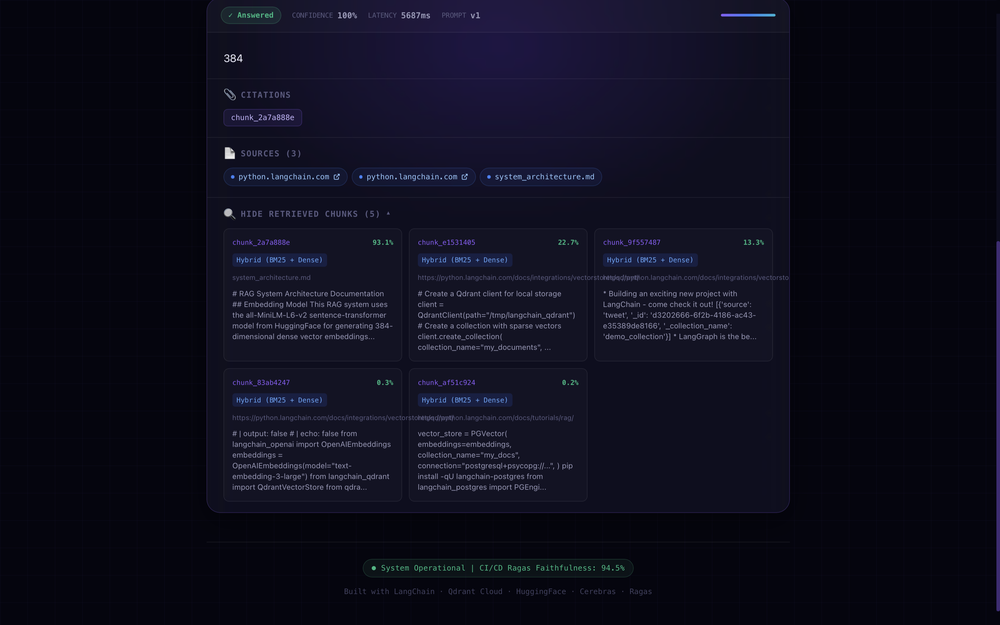

<div align="center">
  

  <h1>🚀 Production-Grade RAG System</h1>
  <p><strong>Hybrid Search • Cross-Encoder Re-Ranking • Citation-Enforced Answers • Cerebras gpt-oss-120b</strong></p>

  <p>
    <a href="#-live-demo">Live Demo</a> •
    <a href="#-how-it-works-the-pipeline">How It Works</a> •
    <a href="#-tech-stack">Tech Stack</a> •
    <a href="#-project-architecture--file-structure">Architecture</a> •
    <a href="#-deployment-architecture">Deployment</a>
  </p>
  
  <p>
    
    
    
    
    
    
  </p>
</div>

---

## ✦ 🌐 Live Demo

The entire application is currently live and deployed!
- 🖥️ **Frontend (Vercel):** [https://production-grade-rag-system.vercel.app/](https://production-grade-rag-system.vercel.app/)
- ⚙️ **Backend API (Hugging Face):** [https://ayush707-rag-backend.hf.space](https://ayush707-rag-backend.hf.space)

---

## ✦ 📸 Showcase (Frontend UI)

Expanding **Retrieved Chunks** shows the re-ranker's work directly: the same five
chunks the LLM saw, each with its cross-encoder confidence and the modality that
found it. Note how sharply the scores fall off — `93.1%` for the chunk that
actually answers the question, then `22.7%`, `13.3%`, `0.3%`, `0.2%`. That spread
is the cross-encoder separating a real match from keyword coincidence.

<div align="center">
  
</div>

---

## ✦ 🧠 How It Works (The Pipeline)

This system goes far beyond a basic "Semantic Search" RAG tutorial. It implements a fully observable, enterprise-ready pipeline designed to eliminate hallucinations and maximize retrieval accuracy:

1. 🔍 **Hybrid Retrieval:** When a user asks a question, the query is simultaneously searched using **BM25** (Sparse keyword matching) and **Dense Vector Embeddings** (semantic matching) inside a Qdrant database.
2. 🎯 **Cross-Encoder Re-Ranking:** The top 10 results from the Hybrid Search are passed through an `ms-marco-MiniLM-L-6-v2` neural network. This Cross-Encoder surgically scores the exact relationship between the query and each chunk, re-ranking them to find the true top 5 results.
3. 🛡️ **Semantic Deduplication:** Before re-ranking, the retrieved chunks are hashed on their leading content. If two chunks contain identical text (e.g., website navigation bars scraped from multiple pages), the duplicates are stripped out so the cross-encoder and the LLM context window are spent on distinct material.
4. ⚡ **Sub-second Generation:** The highly refined context is passed into a strict citation-enforcement prompt. It is generated using `gpt-oss-120b` running on **Cerebras Inference hardware**, guaranteeing lightning-fast, millisecond token generation.
5. 🎨 **Dynamic UI Rendering:** The Next.js frontend uses physics-based CSS animations to cascade the response onto the screen, rendering hover-glow tooltips that display the exact latency and neural confidence score of every retrieved chunk.

---

## ✦ 💻 Tech Stack

### 🖥️ Frontend Frameworks
-  **Next.js 14 (App Router):** Server-side rendered React framework for maximum SEO and speed.
-  **CSS Modules:** Pure vanilla CSS for extreme performance, featuring glassmorphism, `cubic-bezier` physics transitions, and cinematic stagger animations.

### ⚙️ Backend & AI Orchestration
-  **FastAPI (Python):** Blazing fast async API framework handling the entire orchestration.
- 🦜 **LangChain (LCEL):** Modular pipeline construction for complex RAG routing and retrieval logic.
- 🧠 **Cerebras Inference:** Ultra-low latency LLM generation (`gpt-oss-120b`).
- 🤗 **HuggingFace Embeddings:** Local dense embeddings via `all-MiniLM-L6-v2`.
- 🎯 **MS-MARCO Reranker:** Local cross-encoder reranking for maximum precision.
-  **Qdrant Cloud:** Vector database storing the 384-dim dense index. The sparse side is `rank-bm25` in the app process, fused with the dense hits by LangChain's `EnsembleRetriever` (RRF) and rebuilt from Qdrant on startup.

---

## ✦ 📂 Project Architecture & File Structure

The project is structured as a scalable monorepo separating the UI layer from the AI logic layer.

```text
📦 Production-Grade-RAG-system
 ┣ 📂 backend/                 # ⚙️ FastAPI Python Backend (AI Engine)
 ┃ ┣ 📂 app/
 ┃ ┃ ┣ 📂 api/                 # 🌐 FastAPI Router Endpoints (REST API)
 ┃ ┃ ┣ 📂 ingestion/           # 📥 Data Loaders & Text Chunking Logic (Web Scraping)
 ┃ ┃ ┣ 📂 observability/       # 📊 Langfuse Tracing Callbacks for monitoring
 ┃ ┃ ┣ 📂 rag/                 # 🦜 LCEL Chains, Prompts, and Deduplication logic
 ┃ ┃ ┗ 📂 retrieval/           # 🔍 Hybrid Retrievers & MS-MARCO Reranker nodes
 ┃ ┣ 📂 prompts/               # 📝 YAML System Prompts (Citation-enforced)
 ┃ ┣ 📜 Dockerfile             # 🐳 Containerization config (Python venv for HF)
 ┃ ┗ 📜 requirements.txt       # 📦 Python Dependencies
 ┃
 ┣ 📂 evaluation/              # 🧪 Golden dataset + Ragas faithfulness gate
 ┃
 ┗ 📂 frontend/                # 🖥️ Next.js React Frontend (User Interface)
   ┣ 📂 app/                   # 📄 Next.js App Router (page.tsx, layout.tsx)
   ┣ 📂 components/            # 🧩 UI Components (AnswerCard, QueryInput, Tooltips)
   ┗ 📜 package.json           # 📦 Node Dependencies
```

---

## ✦ 🚀 Deployment Architecture

This project is deployed using a 100% free, highly scalable microservice architecture:

### 1. Frontend: Vercel Edge Network 
The React UI is deployed on **Vercel**, taking advantage of global Edge CDNs for zero-latency static asset delivery and instant page loads. It connects to the backend securely via the `NEXT_PUBLIC_API_URL` environment variable.

### 2. Backend: Hugging Face Spaces (Docker) 
The FastAPI Python backend is deployed as a containerized microservice on **Hugging Face Spaces**.
- **Containerization:** A multi-stage `Dockerfile` builds into a venv that the runtime stage copies wholesale, so the dependency tree arrives intact without `build-essential` riding along.
- **Warm cold starts:** The MiniLM embedder and the ms-marco cross-encoder (~180MB) are **baked into the image at build time**. Downloading them on first use would make every cold start wait on `huggingface.co` and turn a hub outage into a failed boot.
- **Staying awake:** Free Spaces sleep after ~48h idle, so `keep-alive.yml` pings `/health` every 6 hours.

### 3. How the deploy actually happens

A Space builds from the `Dockerfile` at **its** repo root — but here that file lives under `backend/`. The `deploy` job bridges the two with a subtree split:

```bash
git subtree split --prefix backend -b hf-deploy   # backend/ becomes the repo root
git push --force "https://…@huggingface.co/spaces/Ayush707/rag-backend" hf-deploy:main
```

Everything outside `backend/` (the frontend, evaluation harness, workflows) never reaches the Space, and the root `.gitignore` governs what ships — which is what keeps `.env` out of a public repo.

> [!IMPORTANT]
> **Never commit `.env`.** Credentials belong in **Space secrets** (Settings ▸ Variables and secrets) and **GitHub Actions secrets** — never in a tracked file. A Space repo is world-readable: anything committed there, including in old commits, can be fetched by anyone at `…/raw/main/<path>`.

### 4. Where each credential goes

| Where | Key | Notes |
|---|---|---|
| **HF Space** secrets | `CEREBRAS_API_KEY`, `QDRANT_URL`, `QDRANT_API_KEY` | What the running backend needs |
| **HF Space** secrets | `ALLOWED_ORIGINS` | Your Vercel origin. Not `*` — `ENVIRONMENT=production` refuses it |
| **HF Space** secrets | `ENVIRONMENT=production` | Enables the CORS wildcard refusal |
| **HF Space** secrets | `INGEST_API_KEY` | Optional. Unset ⇒ `/ingest` returns `503` (closed by default) |
| **GitHub** Actions secrets | `HF_TOKEN` | A **write** token from huggingface.co/settings/tokens |
| **GitHub** Actions secrets | `CEREBRAS_API_KEY`, `QDRANT_URL`, `QDRANT_API_KEY` | For the Ragas gate. Absent ⇒ gate skips, deploy still runs |
| **Vercel** env var | `NEXT_PUBLIC_API_URL` | `https://<user>-<space>.hf.space`, no trailing slash |

---

## ✦ 🛠️ Local Development

### 1. Clone the repository
```bash
git clone https://github.com/Ayush1Deshmukh/Production-Grade-RAG-system.git
cd Production-Grade-RAG-system
```

### 2. Backend Setup
```bash
cd backend
python -m venv .venv
source .venv/bin/activate
pip install -r requirements.txt

# Duplicate .env.example (it lives at the repo root) and fill in your API keys
cp ../.env.example .env

# Seed the vector store — without this the knowledge base is empty and
# every question comes back as a refusal
python scripts/seed.py

# Start the FastAPI server
uvicorn app.main:app --reload --port 8000
```

> The container image serves on port **7860** (Hugging Face Spaces convention).
> `docker compose up` maps it to `http://localhost:8000`.

### 4. Securing the write path

`POST /api/v1/ingest` makes the **server** fetch the URLs you hand it, so it is
closed by default and refuses any target that resolves to a private, loopback,
or link-local address (e.g. cloud metadata at `169.254.169.254`).

```bash
# Generate a secret and put it in backend/.env as INGEST_API_KEY
python -c "import secrets; print(secrets.token_urlsafe(32))"
```

| Variable | Effect |
|---|---|
| `INGEST_API_KEY` | Required in the `X-API-Key` header. Unset ⇒ `/ingest` returns `503 disabled`. |
| `INGEST_ALLOWED_DOMAINS` | Optional hostname-suffix allowlist, e.g. `python.langchain.com`. Empty ⇒ any public host. |
| `ALLOWED_ORIGINS` | Browser origins allowed to call the API. `*` is refused when `ENVIRONMENT=production`. |

```bash
curl -X POST http://localhost:8000/api/v1/ingest \
  -H "X-API-Key: $INGEST_API_KEY" -H "Content-Type: application/json" \
  -d '{"urls": ["https://python.langchain.com/docs/concepts/"]}'
```

> **Deploying:** set `ALLOWED_ORIGINS` on the backend host to your frontend's
> origin. The default is `http://localhost:3000`, which will block your
> deployed frontend.

### 3. Frontend Setup
```bash
cd ../frontend
npm install

# Start the Next.js development server
npm run dev
```

---

<div align="center">
  <p>Built with ❤️ by Ayush Deshmukh.</p>
</div>
